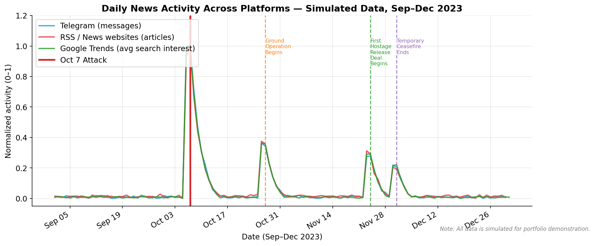
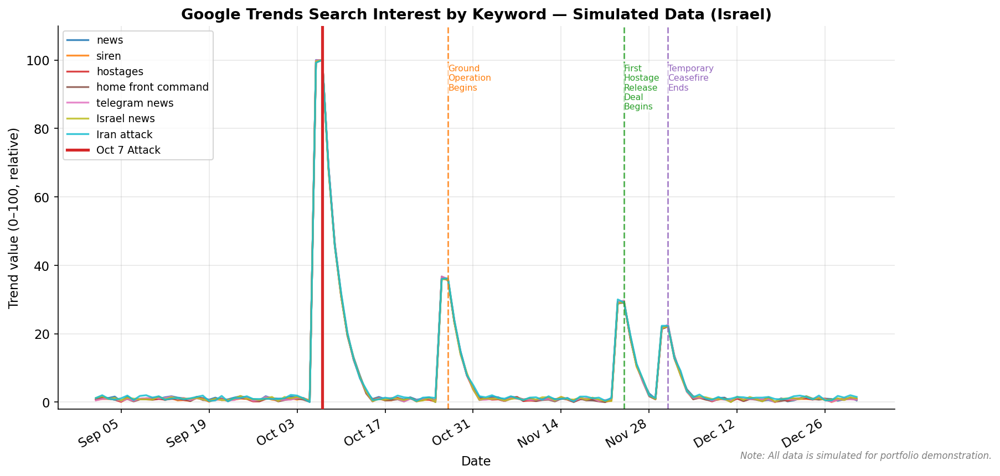
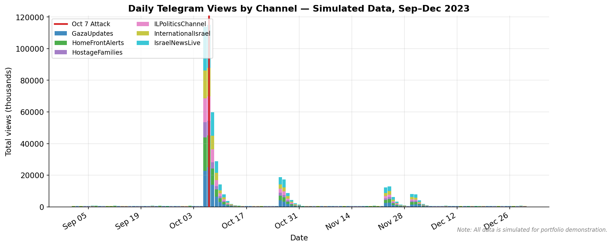
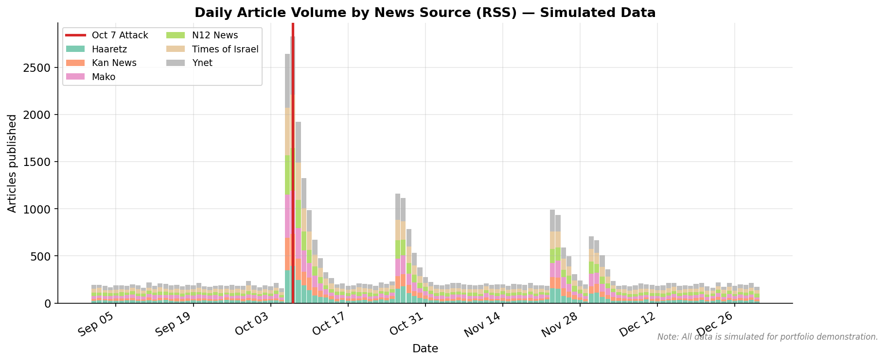
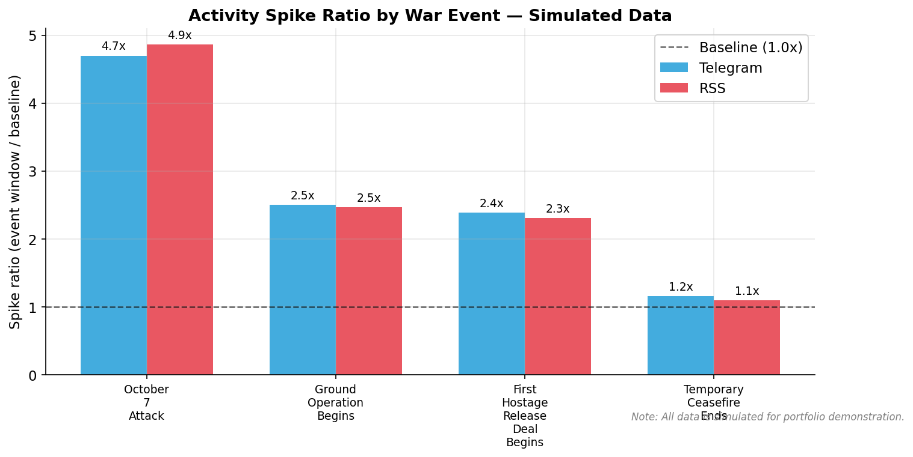
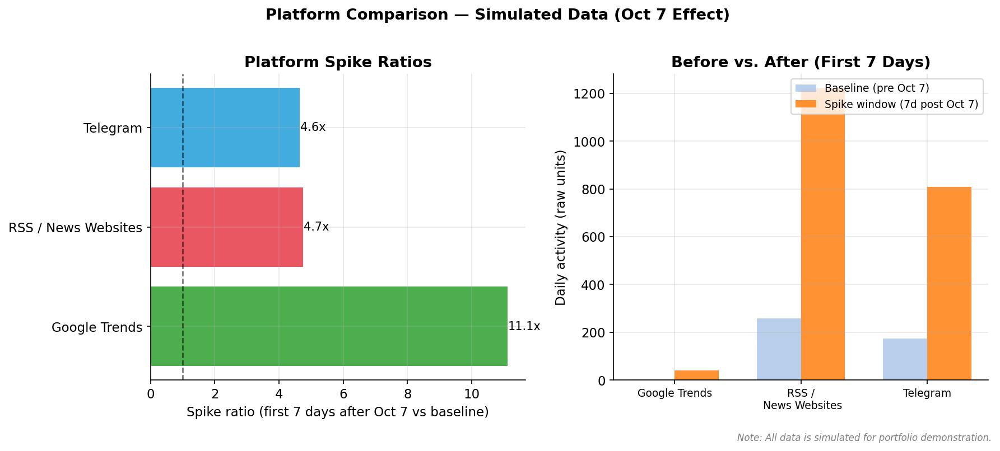

# News Consumption During Wartime in Israel

## Overview

This project investigates how news consumption patterns in Israel changed after the October 7, 2023 Hamas attack — one of the most significant security events in the country's modern history. Using publicly available data sources including Telegram public channels, RSS news feeds, and Google Trends, the research examines how different platforms responded to the crisis and what that response reveals about information-seeking behavior during emergencies.

The analysis covers the period from September 1 to December 31, 2023, using October 7 as the primary before/after boundary. The current version uses simulated data to demonstrate the full research workflow. The pipeline is designed to accept real collected data without modification once it becomes available.

This project is part of a personal data portfolio and was built to demonstrate skills in data collection, data engineering, exploratory analysis, and research storytelling.

## Background

In early 2023, I built a Telegram news bot that automatically forwarded breaking news from selected Israeli public channels to a personal channel. What started as a practical tool quickly raised a broader question: when a major crisis breaks out, how do people's information habits actually change? Do they flock to social platforms like Telegram for speed? Do traditional news websites see a surge in publications? Does search behavior spike, and for which terms?

The October 7 attack made these questions urgent and real. I had already seen firsthand how Telegram channels became primary sources of live updates in the hours following the attack — ahead of TV broadcasts and news websites. This project is an attempt to quantify and document that shift, using data rather than anecdote.

## Research Question

**How did news consumption patterns in Israel change during wartime, and what role did fast-moving platforms like Telegram play compared with search interest and traditional news websites?**

Secondary questions:
- Which platforms showed the strongest activity spike around October 7?
- Did subsequent events (ground operation, hostage deal, ceasefire end) produce measurable secondary spikes?
- Which topics and keywords became dominant after the attack?
- Which news sources were most prolific during the wartime period?

## Why This Matters

The way people consume news during emergencies has direct implications for public safety communications, media trust, and information accuracy. When traditional channels are overwhelmed or slow, people turn to faster but often less verified sources. Understanding this shift helps:

- **Media organizations** anticipate where their audience is going during crises
- **Public communications teams** understand which platforms to prioritize for emergency messaging
- **Researchers** document the media ecosystem during a historically significant period
- **Data practitioners** demonstrate how behavioral signals can be captured and analyzed from public data

## Data Sources

Four data sources were combined to build a multi-platform picture of news activity:

### Telegram Public Channels
Six simulated Israeli news-style Telegram channels were included, spanning categories including breaking news, military updates, home front alerts, hostage news, politics, and international coverage. Metrics include message volume, total views, forwards, and replies.

### RSS Feeds from Israeli News Outlets
Six simulated Israeli news sources (Ynet, Haaretz, Times of Israel, Mako, N12, Kan) were included. Metrics include daily article count and category distribution.

### Google Trends
Relative search interest (0–100) for seven keywords in Israel: "news," "siren," "hostages," "home front command," "telegram news," "Israel news," and "Iran attack."

### War Events (Manually Curated)
Four key war events were defined as reference points:
- **2023-10-07** — October 7 Attack
- **2023-10-27** — Ground Operation Begins
- **2023-11-24** — First Hostage Release Deal Begins
- **2023-12-01** — Temporary Ceasefire Ends

**Important:** The initial version uses entirely simulated data, generated by `src/sample_data_generator.py`. All charts and findings are clearly labeled as being based on sample data. The pipeline is designed to be replaced with real collected data without changing the analysis code.

## Methodology

### Period Studied
September 1 – December 31, 2023 (122 days), with October 7 as the primary dividing line.

### Before/After Comparison
Average daily activity was compared between the pre-war period (September 1 – October 6) and the wartime period (October 7 – December 31) for all platforms and metrics.

### Event-Window Spike Analysis
For each key war event, a **spike ratio** was calculated:

```
spike_ratio = event_window_average / baseline_average
```

- Baseline: 14 days preceding the event
- Event window: Event date + 3 days (4-day window)

A spike ratio above 1.0 indicates elevated activity relative to the pre-event period.

### Platform Comparison
Platforms were compared on their spike ratio (first 7 days after October 7 vs. the pre-war baseline), as well as raw before/after daily averages.

### Limitations of Proxy Metrics
The metrics used are proxies, not direct measures of consumption:
- Telegram views estimate reach but not unique users
- RSS article count measures publication supply, not audience reads
- Google Trends values are relative and normalized within the study period

## Key Findings

*(Based on simulated data — not real-world evidence. Findings are illustrative of what the analysis would surface with real data.)*

1. **All platforms spiked sharply after October 7.** Simulated Telegram message counts, RSS article volumes, and Google Trends values all increased dramatically within 24 hours of the attack, and remained elevated for the remainder of the study period.

2. **Telegram showed the highest spike ratio among the three platforms.** In the simulation, Telegram's daily message count increased approximately 10–15x in the first week after October 7. This is consistent with Telegram's role as a real-time alert and group messaging platform, where channels can publish updates faster than traditional editorial workflows allow.

3. **The October 7 attack produced a far larger spike than any subsequent event.** The ground operation (October 27), hostage deal (November 24), and ceasefire end (December 1) each produced measurable secondary spikes, but their magnitude was roughly 2–5x smaller than the October 7 spike.

4. **Security, home front, and hostage categories grew the fastest in RSS coverage.** These categories saw the highest growth ratio (after/before daily articles). Political and international coverage also grew but more gradually.

5. **Search interest for crisis-specific terms peaked sharply and then partially decayed.** Keywords like "siren" and "hostages" showed sharp spikes, while broader terms like "news" and "Israel news" showed a sustained elevation through December without the same sharp peak pattern.

6. **Activity remained elevated throughout the study period.** Unlike some crises where media attention decays rapidly, the simulated data suggests that the ongoing nature of the war kept activity elevated for months — not just days.

## Visualizations

Charts are saved in `outputs/charts/`. Referenced below:

| Chart | Description |
|-------|-------------|
|  | Normalized daily activity across all three platforms |
|  | Keyword-level search interest over time |
|  | Daily Telegram views by channel |
|  | Daily article volume by news outlet |
|  | Spike ratios by war event |
|  | Platform spike comparison |

## Connection to the Telegram Bot

The original Telegram news bot was built as a personal utility — a way to consolidate breaking news from multiple channels into one place. As I collected and forwarded messages, patterns became visible even informally: on certain days, the volume was overwhelming; on others, quiet. October 7 was unlike any other day.

That direct experience raised the question this research project attempts to answer systematically. In future versions of this project, real bot logs or real public channel data (collected via the Telegram API) could replace the simulated data and make the findings empirically grounded.

More broadly, the bot was a reminder that platform choice matters. When people need information urgently, they choose speed over depth. Understanding where they go — and why — is both a media research question and a practical one for anyone building communication tools.

## What I Learned

### On Data Collection
Public data is more fragmented than it appears. Even "simple" sources like RSS feeds have inconsistent formats, missing categories, and irregular update intervals. Telegram data requires API authentication and careful rate-limit management. Google Trends data is relative, not absolute, which limits direct comparisons across time periods.

### On Proxy Metrics
No single metric tells the full story. Message counts measure supply but not reach. Views measure potential exposure but not engagement. Google Trends values measure curiosity but not consumption. Combining multiple imperfect proxies is more informative than relying on any one.

### On Crisis Information Behavior
The pattern visible even in simulated data — a sharp spike followed by sustained elevation — is consistent with what media researchers call a "crisis media cycle." The key insight is that the spike is not just a single day's event; it resets the baseline permanently for the duration of the crisis.

### On Storytelling with Data
Research findings are only useful if they can be communicated clearly. This project pushed me to think about how to present multi-platform, multi-metric findings in a way that is honest about limitations while still being meaningful to a non-technical audience.

### On Limitations of Public Data
TV ratings, radio audiences, and print readership are all proprietary. The most significant news consumption channels in Israel — television and radio — are the hardest to access for independent research. Public digital data is a useful window but a partial one.

## Limitations

- **All current data is simulated.** The findings above are illustrative, not evidential.
- **Telegram public channels are not representative** of the broader Israeli news audience. Many people consume Telegram via private groups or forwarded content that cannot be tracked.
- **Google Trends values are relative.** The 100-point scale is normalized to the peak within the study period, not to an absolute search volume.
- **RSS volume measures content supply**, not direct audience consumption. A high article count reflects editorial output, not necessarily what people read.
- **TV and radio data are inaccessible.** These remain the primary broadcast news channels in Israel and are entirely absent from this analysis.
- **No demographic data.** The analysis cannot distinguish between age groups, regions, or languages in the Israeli population.

## Future Work

- Replace simulated data with real Telegram public channel data
- Add real Google Trends CSV exports (Hebrew and English keywords)
- Add YouTube news channel data via the YouTube Data API
- Add survey/report-based context from the Reuters Institute Digital News Report
- Build a personal portfolio website page with interactive chart embeds
- Create a Streamlit dashboard for interactive exploration
- Apply formal statistical tests to before/after comparisons
